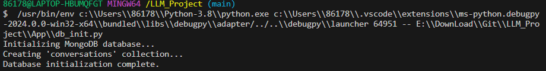

# Finance QA Helper

## Project overview

In finance, addressing a wide range of questions can be challenging, especially for beginners. The complexities of financial markets can feel overwhelming, and professional advisors are not always available.

The Financial Q&A RAG application provides a conversational AI that helps users find answers to various financial inquiries, making financial literacy more accessible.

The Financial Q&A RAG is designed to assist users in navigating diverse financial topics and making informed decisions.


## Dataset

The dataset used in this project contains information about various questions, including:

- **Input:** The question itself.
- **Instruction:** The general category of the exercise.
- **Output:** The answer to that specific question.
- **Source:** The dataset source of this question. (e.g., Investopedia Dataset, Sujet Finance Dataset).


The dataset was from hugging face and contains 384058 records. It serves as the foundation for Finance Analyst's insight and work support. You can find the data in https://huggingface.co/datasets/taddeusb90/finbro-v0.1.0.

## Technologies

- Python 3.8
- Docker and Docker Compose for containerization
- Minsearch for full-text search
- Flask as the API interface
- Grafana for monitoring and MongoDB as the backend for it
- OpenAI and Huggingface models(deepset/roberta-base-squad2) as an LLM 

## Preparation

Since we use OpenAI, you need to provide the API key in the rag.py;
For dependency management, you can use:

```bash
pip install -r requirements.txt
```

## Running the application


### Database configuration

Before the application starts for the first time, the database needs to be initialized.

First, run `mongodb`:

```bash
docker-compose up mongodb
```

Then run the [`db_init.py`](LLM_Project/db_init.py) script:

```bash
cd LLM_Project

export MONGO_URI="mongodb://localhost:27017"
python db_init.py

```

<p align="center">
  
</p>

To check the contents of the database, use the mongo client (bundled with MongoDB):

```bash
mongo --host localhost --port 27017
```
Once connected, switch to your database (e.g., finance_qa):

```bash
use finance_qa
```

To view the schema, you can inspect a document in the collection:
```bash
db.conversations.findOne()
```

To select and view all documents from this collection:

```bash
db.conversations.find().pretty()
```

### Running with Docker-Compose

The easiest way to run the application is with `docker-compose`:

```bash
docker-compose up
```

### Running locally

If you want to run the application locally, start only mongodb and grafana:

```bash
docker-compose up mongodb grafana
```

Now run the app on your host machine:

```bash
cd LLM_Project
python app.py
```

### Running with Docker (without compose)

Sometimes you might want to run the application in
Docker without Docker Compose, e.g., for debugging purposes.

First, prepare the environment by running Docker Compose
as in the previous section.

Next, build the image:

```bash
docker build -t finance-qa .
```

And run it:

```bash
docker run -it --rm \
    --network="finance-qa-default" \
    --env-file=".env" \
    -e OPENAI_API_KEY=${OPENAI_API_KEY} \
    -e DATA_PATH="data/data.csv" \
    -p 5000:5000 \
    finance-qa
```


## Using the application

When the application is running, we can start using it.


### Using `requests`

When the application is running, you can use 'requests' to send questions. Use [sample_send.py](sample_send.py) for testing it:

```bash
python sample_send.py
```

It will use a question as a sample and send it to the app.

### CURL

You can also use `curl` for interacting with the API:

```bash
URL=http://localhost:5000
QUESTION="What is APR"
DATA='{
    "question": "'${QUESTION}'"
}'

curl -X POST \
    -H "Content-Type: application/json" \
    -d "${DATA}" \
    ${URL}/question
```

Sending feedback:

```bash
ID="9c1ceg04-bad5-3v1c-7cjj-6782d8w79e2i"
URL=http://localhost:5000
FEEDBACK_DATA='{
    "conversation_id": "'${ID}'",
    "feedback": 1
}'

curl -X POST \
    -H "Content-Type: application/json" \
    -d "${FEEDBACK_DATA}" \
    ${URL}/feedback
```

After sending it, you'll receive the acknowledgement:

```json
{
    "message": "Feedback received for conversation 9c1ceg04-bad5-3v1c-7cjj-6782d8w79e2i: 1"
}
```

### Interface

We use Flask for serving the application as an API. And We plan to develop a fronted-end web page in the near future.
### Ingestion

The ingestion script is in [`ingest.py`](LLM_Project/ingest.py).

Since we use an in-memory database, `minsearch`, as our knowledge base, we run the ingestion script at the startup of the application.

It's executed inside [`rag.py`](LLM_Project/rag.py) when we import it.

## Experiments

For experiments, we use Jupyter notebooks.
They are in the [`notebooks`](notebooks/) folder.

We have the following notebooks:

- [`rag-test.ipynb`](notebooks/rag-test.ipynb): The RAG flow and evaluating the system.
- [`evaluation-data-generation.ipynb`](notebooks/evaluation-data-generation.ipynb): Generating the ground truth dataset for retrieval evaluation.

### Retrieval evaluation

The basic approach - using `minsearch` without any boosting - gave the following metrics:

- Hit rate: 94%
- MRR: 82%

The improved version (with tuned boosting):

- Hit rate: 94%
- MRR: 90%

The best boosting parameters:

```python
boost = {
    'exercise_name': 2.11,
    'type_of_activity': 1.46,
    'type_of_equipment': 0.65,
    'body_part': 2.65,
    'type': 1.31,
    'muscle_groups_activated': 2.54,
    'instructions': 0.74
}
```

### RAG flow evaluation

We used the LLM-as-a-Judge metric to evaluate the quality
of our RAG flow.

For `gpt-4o-mini`, in a sample with 200 records, we had:

- 167 (83%) `RELEVANT`
- 30 (15%) `PARTLY_RELEVANT`
- 3 (1.5%) `NON_RELEVANT`

We also tested `gpt-4o`:

- 168 (84%) `RELEVANT`
- 30 (15%) `PARTLY_RELEVANT`
- 2 (1%) `NON_RELEVANT`

The difference is minimal, so we opted for `gpt-4o-mini`.

## Monitoring

We use Grafana for monitoring the application. 

It's accessible at [localhost:3000](http://localhost:3000):

- Login: "admin"
- Password: "admin"

### Dashboards

<p align="center">
  
</p>


### Setting up Grafana

All Grafana configurations are in the [`grafana`](grafana/) folder:

- [`init.py`](Grafana/init.py) - for initializing the datasource and the dashboard.
- [`dashboard.json`](Grafana/dashboard.json) - the actual dashboard (taken from LLM Zoomcamp without changes).

To initialize the dashboard, first ensure Grafana is
running (it starts automatically when you do `docker-compose up`).

Then run:

```bash
cd grafana
env | grep MONGODB_HOST

python init.py
```

Then go to [localhost:3000](http://localhost:3000):

- Login: "admin"
- Password: "admin"

When prompted, keep "admin" as the new password.

### Flask

We use Flask for creating the API interface for our application.
